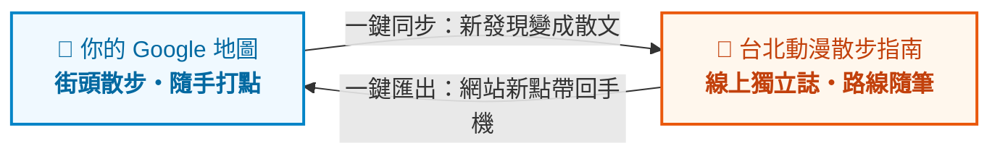

# 《台北動漫散步指南》Taipei Anime Walk

> 「今天好像也沒什麼特別的目的，只是想出門走一走。」  
> 一本記錄台北街頭那些吹著冷氣、翻翻舊書、走累了就坐下發呆的**二次元日常散步隨筆兼地圖**。

🌐 **線上公開網址**：[https://johnsonchung.github.io/taipei-anime-walk/](https://johnsonchung.github.io/taipei-anime-walk/)

---

## 🍃 關於這裡：沒有目的與答案的日常

這裡不是嚴肅的商業黃頁，也沒有必去不可的標準答案。只是一群喜歡二次元與街頭散步的人，記下的一點生活碎屑：

1. **日常散步大於刻意攻略**：不評價幾顆星，只記下老商場走道的紙箱味、轉身時背包要抱在胸前的小提醒，還有走累時轉角能坐下來喝杯茶的長凳。
2. **順路漫遊大於狂踩點**：順著心情慢慢走，走累了隨時停下來休息，沒有一定要買到什麼的壓力。
3. **留在昨天的小店**：有些老店雖然拉下了鐵捲門，但我們不急著抹掉它，在心裡替它留個小小的記憶印記。
4. **乾淨純粹的無商用空間**：全站無廣告、無業配贊助，純靜態架構，安安靜靜地待在 GitHub 上。

---

## 🤖 模組化 AI 指引體系 (`guidelines/ai/`)

本專案將 AI 定位為「散步隨筆編輯秘書」，依據任務拆分為 5 份獨立指引：

| 模組指引 | 角色定位 | 核心職責 |
| :--- | :--- | :--- |
| [`01-editorial-curator.md`](guidelines/ai/01-editorial-curator.md) | **日常系散步風格專員** | 禁絕宏大口號與廣告套話，以輕小說日常散文筆調描繪空間細節與歇腳處。 |
| [`02-spatial-navigator.md`](guidelines/ai/02-spatial-navigator.md) | **空間動線專員** | 評估散步步調（1~5 ⚡）與背包會車空間，規劃順暢不折返的路線。 |
| [`03-data-cleanser.md`](guidelines/ai/03-data-cleanser.md) | **圖資清洗專員** | 解析 Google My Maps KML，篩出真正具備漫步質感的街角小店。 |
| [`04-community-archivist.md`](guidelines/ai/04-community-archivist.md) | **回憶整理專員** | 將 Issue 投稿轉為隨筆，替歇業老店寫下溫柔的昨日記憶。 |
| [`05-tech-guardian.md`](guidelines/ai/05-tech-guardian.md) | **純靜態架構守門員** | 確保無伺服器後端、免收費 API Key，維持 GitHub Pages 零成本運行。 |

---

## 🛠️ 技術架構

* **靜態框架**：[Astro 5](https://astro.build/)（零 JavaScript 優先、Markdown Content Collections、Zod 型別驗證）
* **樣式排版**：[Tailwind CSS](https://tailwindcss.com/)（日系紙質底色、墨黑文字、微顆粒質感）
* **街道地圖**：[Leaflet.js](https://leafletjs.com/) + **CARTO Positron** 極簡淺灰日系底圖（免 API Key、零成本）
* **資料與部署**：GitHub 倉庫 Markdown + GitHub Actions 自動發布至 GitHub Pages

---

## 📮 隨筆投稿小箱

如果你在台北街頭晃悠時，也發現了某個舒服安靜的角落，歡迎來分享：
- **推薦新角落**：點選 `Issues` ➔ `[新點位投稿]`，隨意聊聊走道寬度和歇腳的地方。
- **回憶老小店**：點選 `[時光膠囊封存]`，記下它留在昨天的模樣。

---

## 📌 未來規劃與待辦 (TODO)

詳細技術評估與待辦事項請參閱 [`TODO.md`](TODO.md)。

### 雙向冷同步概念（個人 Google Maps ⇄ 網站隨筆）

> **日常漫遊情境**：外出散步看到好店，在 Google 地圖隨手釘一下；想整理時按一個鍵，足跡自動同步進網站變成散步隨筆。網站社群推薦的新地點，也能一鍵收回自己的手機地圖帶著走。
